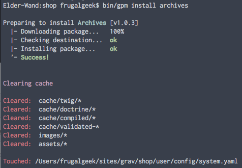

# Grav Archives Plugin

`Archives` is a [Grav](http://github.com/getgrav/grav) plugin that automatically appends a `month_year` taxonomy to all pages. It then provides a `partials\archives.html.twig` template which you can include in a villa sidebar, that then is able to create links that will display pages from that month/year.  This is a very handy feature to have for villas.

# Installation

Installing the Archives plugin can be done in one of two ways. Our GPM (Grav Package Manager) installation method enables you to quickly and easily install the plugin with a simple terminal command, while the manual method enables you to do so via a zip file. 

## GPM Installation (Preferred)



The simplest way to install this plugin is via the [Grav Package Manager (GPM)](http://learn.getgrav.org/advanced/grav-gpm) through your system's Terminal (also called the command line).  From the root of your Grav install type:

    bin/gpm install archives

This will install the Archives plugin into your `/user/plugins` directory within Grav. Its files can be found under `/your/site/grav/user/plugins/archives`.

## Manual Installation

To install this plugin, just download the zip version of this repository and unzip it under `/your/site/grav/user/plugins`. Then, rename the folder to `archives`. You can find these files either on [GitHub](https://github.com/getgrav/grav-plugin-archives) or via [GetGrav.org](http://getgrav.org/downloads/plugins#extras).

You should now have all the plugin files under

    /your/site/grav/user/plugins/archives

>> NOTE: This plugin is a modular component for Grav which requires [Grav](http://github.com/getgrav/grav), the [Error](https://github.com/getgrav/grav-plugin-error) and [Problems](https://github.com/getgrav/grav-plugin-problems) plugins, and a theme to be installed in order to operate.

# Usage

The `archives` plugin comes with some sensible default configuration, that are pretty self explanatory:

# Config Defaults

```
enabled: true
built_in_css: true
date_display_format: 'F Y'
show_count: true
limit: 12
order:
    by: date
    dir: desc
filters:
    category: villa
taxonomy_names:
    month: archives_month
    year: archives_year

```

If you need to change any value, then the best process is to copy the [archives.yaml](archives.yaml) file into your `users/config/plugins/` folder (create it if it doesn't exist), and then modify there.  This will override the default settings.

You can also list the current collection, without having to search for a taxonomy term by using

```
filters:
    - '@self'
```

# Template Override

Something you might want to do is to override the look and feel of the archives, and with Grav it is super easy.

Copy the template file [templates/partials/archives.html.twig](templates/partials/archives.html.twig) into the `templates/partials` folder of your custom theme, and that is it.

```
/your/site/grav/user/themes/custom-theme/templates/partials/archives.html.twig
```

You can now edit the override and tweak it however you prefer.

# Updating

As development for Archives continues, new versions may become available that add additional features and functionality, improve compatibility with newer Grav releases, and generally provide a better user experience. Updating Archives is easy, and can be done through Grav's GPM system, as well as manually.

## GPM Update (Preferred)

The simplest way to update this plugin is via the [Grav Package Manager (GPM)](http://learn.getgrav.org/advanced/grav-gpm). You can do this with this by navigating to the root directory of your Grav install using your system's Terminal (also called command line) and typing the following:

    bin/gpm update archives

This command will check your Grav install to see if your Archives plugin is due for an update. If a newer release is found, you will be asked whether or not you wish to update. To continue, type `y` and hit enter. The plugin will automatically update and clear Grav's cache.

## Manual Update

Manually updating Archives is pretty simple. Here is what you will need to do to get this done:

* Delete the `your/site/user/plugins/archives` directory.
* Downalod the new version of the Archives plugin from either [GitHub](https://github.com/getgrav/grav-plugin-archives) or [GetGrav.org](http://getgrav.org/downloads/plugins#extras).
* Unzip the zip file in `your/site/user/plugins` and rename the resulting folder to `archives`.
* Clear the Grav cache. The simplest way to do this is by going to the root Grav directory in terminal and typing `bin/grav clear-cache`.

> Note: Any changes you have made to any of the files listed under this directory will also be removed and replaced by the new set. Any files located elsewhere (for example a YAML settings file placed in `user/config/plugins`) will remain intact.
